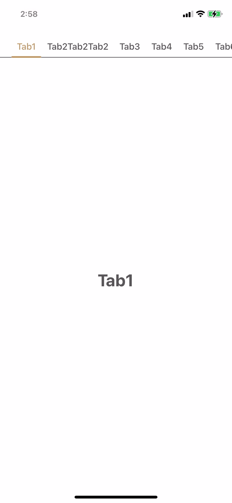

# TabsPager
Quick setup pager with scrollable tabs




## Requirements
- iOS 11 or any higher version
- Xcode 12 or any higher version
- Swift 5

## Installation

### Cocoapods
Add the pod to your Podfile:
```ruby
pod 'TabsPager'
```

And then run:
```ruby
pod install
```
Import TabsPager:
```swift
import TabsPager
```

## Usage

1. Init TabsPager
```swift
var tabsPager = TabsPager()
```
2. Set TabsPager attributes if you want before assign viewControllers
```swift
// change tabPager background color
tabsPager.backgroundColor = .gray

// change whole tabs background color
tabsPager.tabColor = .yellow

// change the line below tabs
tabsPager.tabLineColor = .green

// change title text color in tab
tabsPager.tabTitleColor = .red

// change title text color in tab when selected
tabsPager.tabSelectedTitleColor = .brown

// change slider color
tabsPager.sliderColor = .blue

// change title text font in tab
tabsPager.tabTextFont = .systemFont(ofSize: 18)
```
3. Add TabsPager to your view
```swift
self.addChild(tabsPager)
view.addSubview(tabsPager.view)
tabsPager.view.fillSuperview()
```

4. Assign viewControlles into TabsPager
> ViewController must inherit TabPagerContentVC
```swift
import UIKit
import TabsPager

class ContentViewController: TabPagerContentVC { }
```
```swift
var tabs = ["Tab1", "Tab2", "Tab3"]
var vcs: [ContentViewController] = []
for (i, title) in tabs.enumerated() {
    let vc = ContentViewController()
    vc.pageIndex = i // Override page index
    vc.tabTitle = title // Override tab title
    vcs.append(vc)
}

tabsPager.contentVCs = vcs
```
